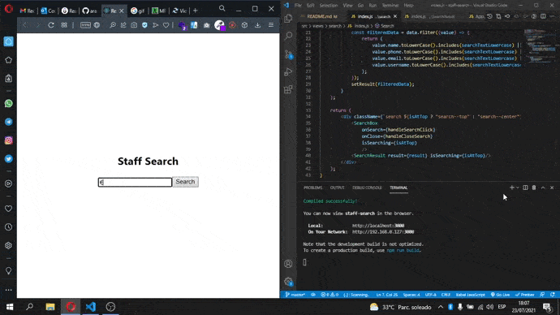

# React project 'Staff search'
Basic React App with an employee finder, using a public API of different names and emails (JSON)

## Available Scripts

In the project directory, you can run:

### `npm start`

Runs the app in the development mode.\
Open [http://localhost:3000](http://localhost:3000) to view it in the browser.

The page will reload if you make edits.\
You will also see any lint errors in the console.

## DEMO 
 